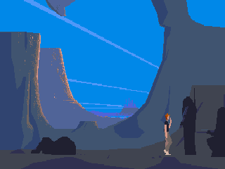

Another World (Out of This World) for Motorola
==============================================

Port of the Another World (Out of This World) game to Motorola Linux phones on EZX and MotoMAGX platform using the [raw](https://github.com/cyxx/rawgl/tree/raw) engine by Gregory Montoir.





## EZX Build Recipe

```
mkdir ANOTHER
cp ~/Downloads/ANOTHER/BANK* ANOTHER/
cp ~/Downloads/ANOTHER/MEMLIST.BIN ANOTHER/

cd ezx/
. /opt/toolchains/motoezx/setenv-a1200-devezx.sh
make clean
make

cd ..
. /opt/toolchains/motoezx/setenv-a1200.sh
make -f Makefile.ezx clean
make -f Makefile.ezx
make -f Makefile.ezx dist

/usr/bin/curl -T Another_World_Raw_EZX_0.1.1.pkg ftp://root:@192.168.16.2//mmc/mmca1/
/usr/bin/curl -T Another_World_Raw_EZX_0.1.1.mpkg ftp://root:@192.168.16.2//mmc/mmca1/
```

## MotoMAGX Build Recipe

```
TODO: Soon.
```

## EZX Control Keys

* D-Pad or Joystick -- Movement.
* Volume "+" -- Action.
* Volume "-" -- Jump.
* Hangup Key -- Exit.
* Call Key -- Enter save code.
* Camera Key or Play/Pause Key (ROKR E6) -- Pause.
* Mod Key and Camera Key -- Fast Forward.
* Mod Key and Volume "+" or Forward Key (ROKR E6) -- Cheat saving game.
* Mod Key and Volume "-" or Backward Key (ROKR E6) -- Cheat loading game.
* Mod Key and Call Key -- Enable or Disable audio.

Mod Key is Voice Key (below Volume Keys) on Motorola MING A1200 and Operator Key (below Hangup Key) on Motorola ROKR E6.

## MotoMAGX Control Keys

* TODO: Soon.

## Credits

* Gregory Montoir (raw engine).
* Limows and EXL (EZX and MotoMAGX port).
